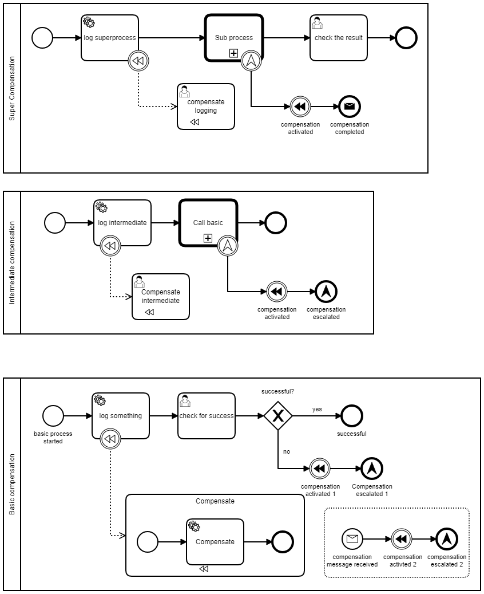

# Compensation in Call Activities

This projects shows how to handle compensation in processes. It includes a chain of three subprocesses, that are invoked as call activities. The service tasks have a compensation associatied.

When the compensation is triggered in the leaf subprocess, all compensation in the super processes are invoked as well and the caller will beforomred, that the compensation is completed.

The pattern to reach this goal is to trigger the compensation in the leaf process, escalate the compensation to the upper process and inform the caller in the root process.

Have a look into the [ProcessTest.java](src/test/java/com/camunda/consulting/compensation_examples/ProcessTest.java) to see how the processes are executed.

Build with Camunda 7.9.0 spring-boot-starter

To try it out, build it with `mvn clean package` and run it with `java -jar target/compensation-examples.jar`